# Environment Variables & Set-UID Lab

## Task 1: Manipulating Environment Variables

**Commands / Description:**
printenv, export, unset / As shown in the command name itself, printenv shows all the environment variables that you currently have. Environment variables are pieces of data that exist in a specific, typically the current session you're on (username, path, etc). With commands such as export and unset you can decide what your environment variables, and what you can remove.

**Screenshot:** 
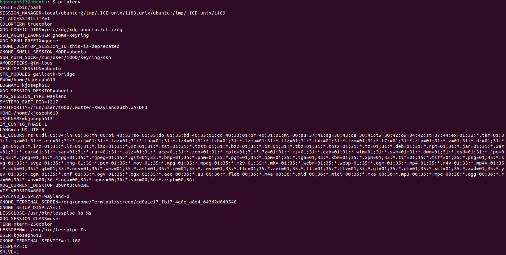
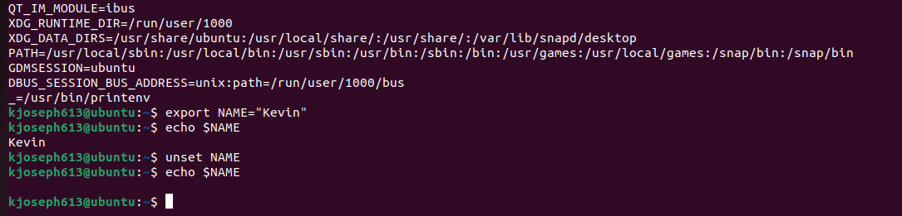

## Task 2: Passing Environment Variables from Parent to Child Process

**Commands / Description:**
nano myprintenv.c, gcc myprintenv.c, ./a.out > file1.txt, ./a.out > file2.txt,diff file1.txt file2.txt / In this task we run a C program called "myprintenv.c" which gives us all the environment variables from the parent or child process which was created with the fork() command. After compilation we compare the outputs through the child and parent process. This means that if we don't see a change that means the child process takes in all the environtment variables from the parent. When I used the diff command I noticed there were some changes which indicates how my shell modifies those variables.

**Screenshot:** 
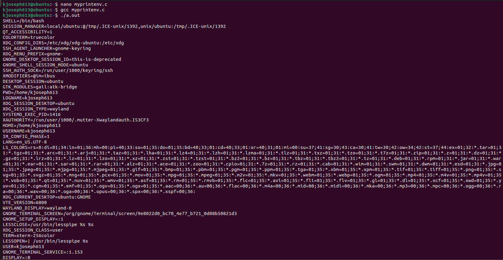
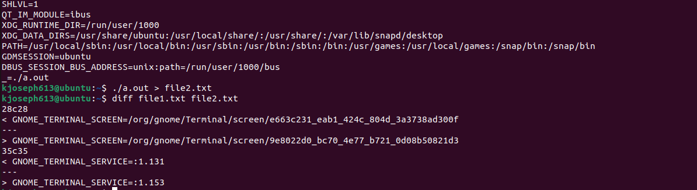

## Task 3: Environment Variables and execve()

**Commands / Description:**
nano myenv.c, gcc myenv.c, / In this task we run a C program called "myenv.c" and based on the current exceve() command I ran the program. As expected no output was given because the execve() didn't have nothing to run. However, when I gave the execve() an argument, envrion, it printed all the environment variables as shown in the screenshots.

**Screenshot:** 
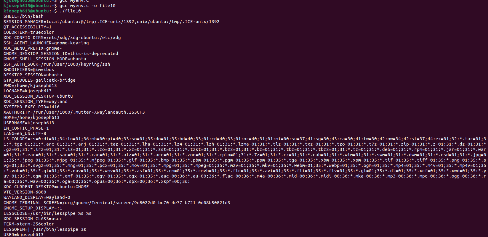
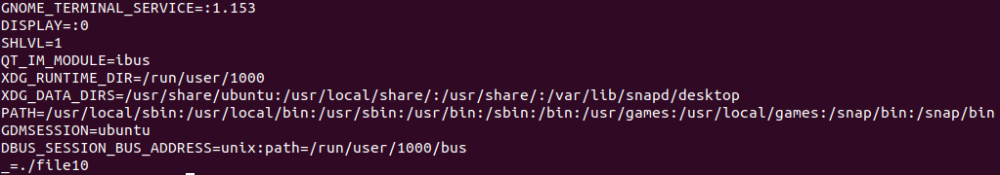

## Task 4: Environment Variables and system()

**Commands / Description:**
nano system.c, gcc system.c -o env, ./env / During this task we run a C program called "system.c" and this time instead of switching up the execve() command we see how the environment variables are affected while utilizing the system() command. As we see in the compilation, we get our usual environment variables, no changes here.

**Screenshot:** 
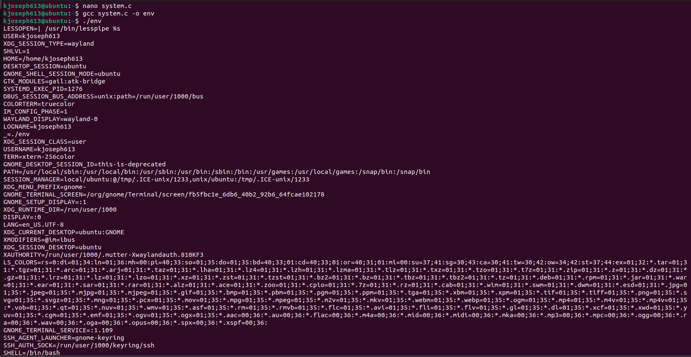
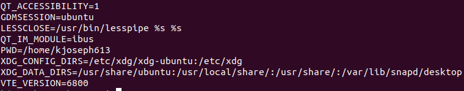

## Task 5: Environment Variables and Set-UID Programs

**Commands / Description:**
nano environ.c, gcc environ.c -o env, ./env, sudo chown root env, sudo chmod 4755 env, export PATH=$PATH:/home/kevin/test, export LD_LIBRARY_PATH=/home/kevin/testlib, export MYVAR="Hey", ./env / In this task we take the code given to us and we convert that into a Set-UID program. A Set-UID program is a program that always assumes the owner's privilges. Although there are alot of benefits to this, it's very risky because it's vulnerable to attackers who can gain access to the entire program. Nonetheless, here we took a program, converted it into Set-UID, and exported some variables so we can see those changes upon running the program again. As expected, the changes that I performed were shown in the terminal as I ran the program again.

**Screenshot:** 
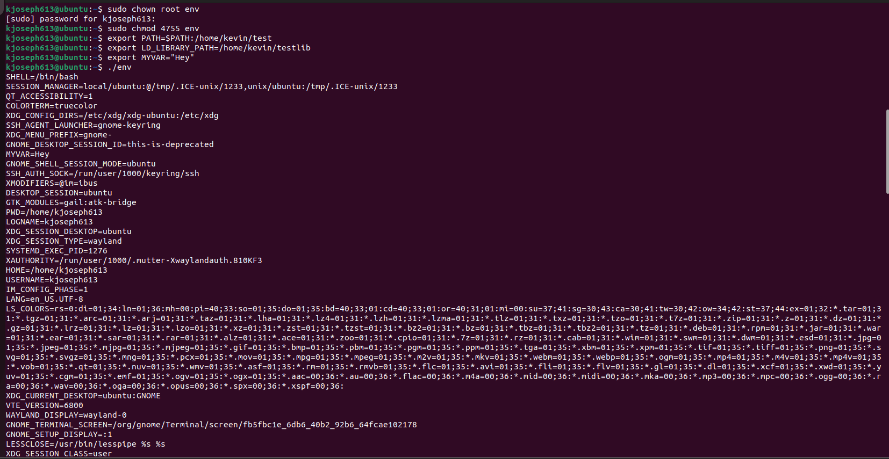
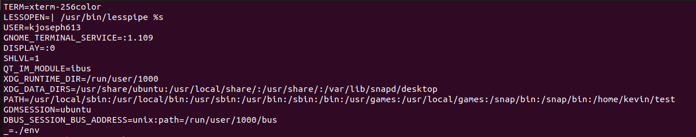

## Task 6: The PATH Environment Variable and Set-UID Programs

**Commands / Description:**
nano test.c, gcc test.c -o test, ./env, sudo chown root:root ./test, sudo chmod 4755 ./test, mkdir -p /tmp/mypath, export PATH=/tmp/mypath:$PATH / Since we understand how Set-UID programs are vulnerable to attackers, I wanted to see that if I created malicious code that the Set-UID program would be able to run. If it did, I also wanted to see if it would run with root privilege. Based on my results, the Set-UID program didn't run the malicious code, and this also means I didn't get root access. Understanding what code to write was tricky, but this is good for us knowing our file is safe.

**Screenshot:** 
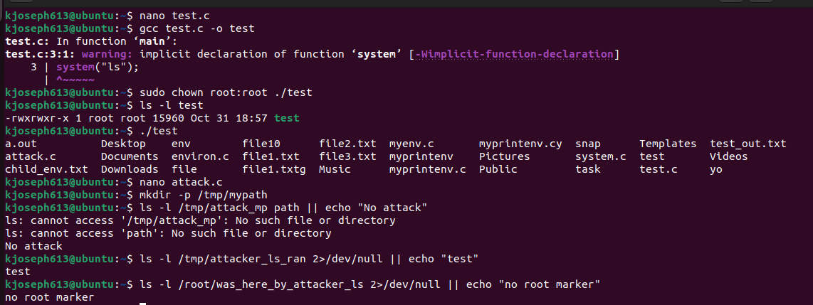

## Task 7: The LD_PRELOAD Environment Variable and Set-UID Programs

**Commands / Description:**
nano mylib.c, nano myprog.c, sudo chown root:root, sudo chmod 4755, ./my / This task we learn about the LD_PRELOAD environment variable. With this environment variable it tells the dynamic loader which libaries should be searched for first out of the standard libraries that are available. This is good if you needed to test a specific program, debug any problems, and just managing what libraries you're working with. However, based on our results we learn that the dynamic linker ignores the LD_PRELOAD environment variable when it comes to running Set-UID, root-controlled programs. This security measure prevents strangers from getting acesss to a program where they aren't wanted. 
   
**Screenshot:** 
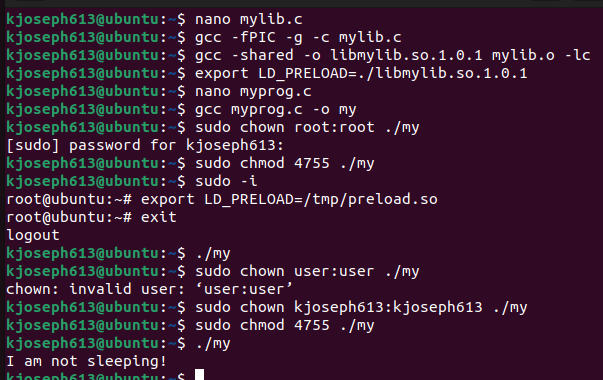

## Task 8: Invoking External Programs Using system() versus execve()

**Commands / Description:**
nano catall.c, sudo chown root:root catall.c, sudo chmod 4755 catall.c / Based on everything we did so far we understand that system() is a dangerous piece of code in powerful programs as opposed to exceve(), a safer approach. This is because exceve() runs a program without using a shell thus preventing any unauthorized users from entering. With that information this task tells us to compare both commands and see what is effective if an attack were to happen. I'll admit this task was diffcult for me to perform because of understanding commands with its specific paths and such. If I were to utilize the system() command then yes, I can remove a file thats not writable to me. Nonetheless, despite not getting the results I desired, I know that attacks in the first step did execute. As previously mentioned these attacks work against code that uses the system() command which is a vulnerability.
   
**Screenshot:** 

## Task 9: Capability Leaking

**Commands / Description:**
nano cap_leak.c, sudo chown root:root cap_leak.c, sudo chmod 4755 cap_leak.c / When we talk about capability leaking, its when a program goes back to its normal state after being the root, but still have access to root privileges. This is a problem because in a Set-UID program which is already vulnerable to attackers, a user that falls under a capability leak has full creative control of that program. Upon compilation of my program I wasn't able to exploit the capability leaking vulernablity because nothing was gained. Since the file given couldn't open, that means there wasn't no capability leak that could be exploited. 

**Screenshot:** 
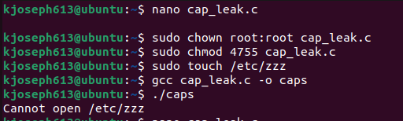

