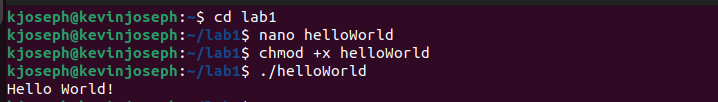

# The Linux Command Line Lab

## Task 1: Changing to the Root User

**Commands / Description:**
sudo su root / This command allows a user to run with superuser permissions to become the root user. 

**Screenshot:**

## Task 2: Creating Users with Useradd and Adduser

**Commands / Description:**
sudo useradd bobby, sudo adduser sally / The difference between these two commands is that when you're using the command "adduser" it's a more informative and secure approach. After "useradd" it didn't mention anything else as opposed to "adduser" which told me it was being added as a user, a group, given a home directory, and asked me to type a password as well.

## Task 3: Switching the User

**Commands / Description:**
sudo su - sally / This command prompts me to enter my password which results the main user to be changed to sally, a user that was created using "adduser" command.

**Screenshot:**

## Task 4: Adding Users after Switching Users

**Commands / Description:**
sudo useradd earl / After running this command the prompt tells me "sally is not in the sudoers file. This incident will be reported". The reason this occurs because sally is a normal user and doesn't have root privileges so it doesn't allow her to perform such action.

## Task 5: Peforming Tasks as Original User

**Commands / Description:**
exit / Despite the benefits of completing tasks and commands as the root user it's bad practice to stay logged in as root because you can make critcal mistakes much easier. Being the root user means you have power to everything just as the saying says "great power comes with great responsibility" and this can lead to files being changed or even deleted accidentally. Additionally, being the root user can leave you vulnerable to attackers which could lead them to have entire control of your system.

## Task 6: Deleting Users and Viewing your User ID

**Commands / Description:**
sudo userdel earl, id -u / In order to delete the users you create you just type "sudo userdel (User Name)". Upon using the "exit" command to get to my original user, I typed in "id -u" to see what me user id was. The prompt showed me 1000, and this is true because since I'm the main user it also means that I was the first person to be created in the Ubuntu server. User IDs below 1000 mean they're for lower level permissions / regular users.

## Task 7: Groups Belonging to Ubuntu

**Commands / Description:**
groups / Upon typing the groups command I get to see what groups kjoseph (My User Name,AKA Ubuntu) is a part of it. The prompt says "kjoseph adm cdrom sudo dip plugdev lpadmin lxd sambashare". These are the groups that are always associated with the main user AKA Ubtuntu.

## Task 8: Peforming Group Tasks

**Commands / Description:**
groups, sudo groupadd cybersec, sudo usermod -aG sudo sally, sudo usermod -aG cybersec sally / In this task we are utilizing the use of sudo and group commands. The user "sally" that we have created before, we must give her sudo privileges so that she could create a group, add herself or other users to it, and determine all groups sally, now sudo user, are a part of. The bash script tells us that "sally" is a part of the groups, "sally", "sudo, "cybersec". (the group recently created)

**Screenshot:**

## Task 9: Creating Directories and Finding Permissions

**Commands / Description:**
mkdir lab1, ls -ld lab1 / With these commands we can make a directory and determine which group of users have pemrission to read, write, execute, or all.  Upon typing the command "ls -ld lab1", the owner and group owner are both kjoseph. (me, the main user) To determine the permissions of the group owner, owner, and then the others you have to group the letters and symbols of three when going from left to right. You first ignore the first letter or symbol because that will tell you if its a directory or file. Afterwards the first three will be the owner's permissions, then the next three will be the group owner's permissions and the last three will be the general public's permissions. In this case both the owner and group can read, write and execute files. However, the general public can only read and execute.

**Screenshot:**

## Task 10: Creating Bash Files and use of Nano

**Commands / Description:**

cd lab1, nano helloWorld, #!/bin/bash echo "Hello World!, chmod +x helloWorld, ./helloWorld / With this task we change our directory by adding a new bash file called "helloWorld". Our goal is to run a program that exceutes "Hello World!" by making it executable and calling its path. When we call nano, this opens up a small editor that's user-friendly and simple. Here we write what we want to see upon calling this program and upon completion we save and exit and make this executable so we can run it. This was a sucess after we got our desired output.

**Screenshot:**

## Task 11: Additional Viewing of Permissions and Modifications

**Commands / Description:**
ls -la helloWorld / After creating the bash file "helloWorld" we have decided to view the permissions of it and see how we can modify it to change the permissions of other groups. When I type in the commands, I get that both owner and group owners have read, write, and execute permissions. The general public (other) has only the permissions to read and execute. Hypothetically if we say that the group owner only had read permissions we can modify this so they can write and execute. To perform this we just type in "chmod g+wx helloWorld" and this will allow helloWorld to now read, write, and execute. (Assuming group can already read) 

## Task 12: Use of Access Control Lists

**Commands / Description**: 
getfacl, setfacl -m u:sally:rw helloWorld / Although I have previously shown commands to show and modify permissions of all users, with the use of Access Control Lists (ACL) this is a more efficient and flexible way of managing the 'crowd'. With the "getfacl" command we the prompt shows us not only the permisisons of thr owner, group, and others but it shows us the names of everyone involved in one setting. The "setfacl" command not only helps us modify permissions for different groups but specific users with certain permisisions to maintain the hierarchy of a system. For our example, I used "sally" and gave her only read and write permissions.

**Screenshot:**

